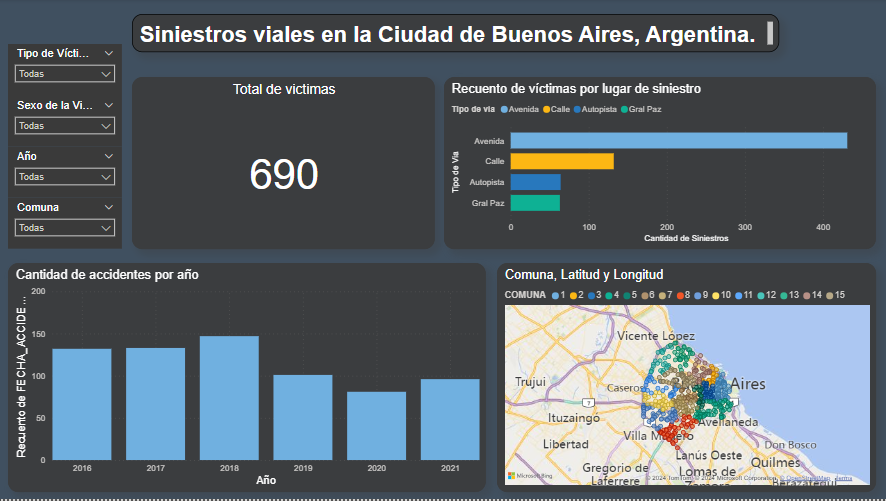

# Análisis de Siniestros Viales en Buenos Aires

### Información General
***
Este proyecto tiene como objetivo abordar la problemática de los siniestros viales en la Ciudad de Buenos Aires mediante un análisis exhaustivo de datos proporcionados por el Observatorio de Movilidad y Seguridad Vial (OMSV). 
La iniciativa busca generar información valiosa que permita a las autoridades locales implementar medidas efectivas para reducir la cantidad de víctimas fatales en accidentes de tránsito. 

