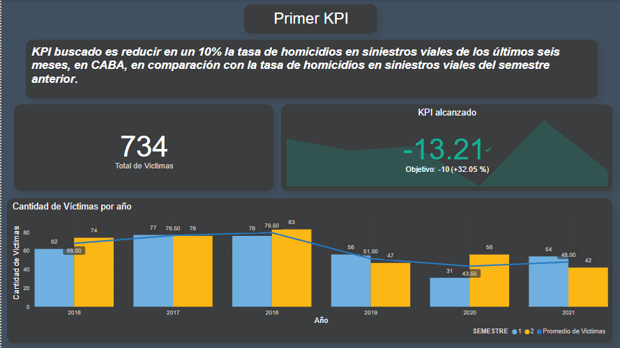
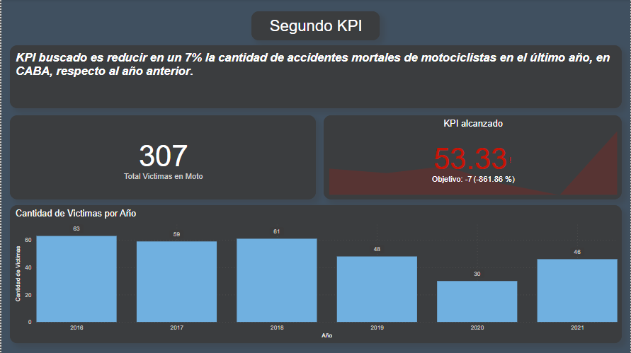

# Análisis de Siniestros Viales en Buenos Aires

***

### Información General
***
Este proyecto tiene como objetivo abordar la problemática de los siniestros viales en la Ciudad de Buenos Aires mediante un análisis exhaustivo de datos proporcionados por el Observatorio de Movilidad y Seguridad Vial (OMSV). 
La iniciativa busca generar información valiosa que permita a las autoridades locales implementar medidas efectivas para reducir la cantidad de víctimas fatales en accidentes de tránsito. 

## Contexto
***
En Argentina, cada año mueren cerca de 4.000 personas en siniestros viales. Aunque muchas jurisdicciones han logrado disminuir la cantidad de accidentes de tránsito, esta sigue siendo la principal causa de muertes violentas en el país. Los informes del Sistema Nacional de Información Criminal (SNIC), del Ministerio de Seguridad de la Nación, revelan que entre 2018 y 2022 se registraron 19.630 muertes en siniestros viales en todo el país. Estas cifras equivalen a 11 personas por día que resultaron víctimas fatales por accidentes de tránsito.

Solo en 2022, se contabilizaron 3.828 muertes fatales en este tipo de hechos. Los expertos en la materia indican que en Argentina es dos o tres veces más alta la probabilidad de que una persona muera en un siniestro vial que en un hecho de inseguridad delictiva.

## Datos
***
Para llevar a cabo este proyecto la identidad correspondiendte, en este caso el Observatorio de Movilidad y Seguridad Vial, que es un organismo que trabaja en la órbita del "Secretaría de Transporte del Gobierno de la Ciudad autónoma de Buenos Aires" brindó un dataset sobre homicidios en siniestros viales acaecidos en la Ciudad de Buenos Aires durante el periodo 2016-2021. En este se encontraba datos de las víctimas tales como sexo, edad, rol en el siniestro, vehículo damnificado(en caso de haberlo) y vehículo acusado de propiciar el siniestro, entre otros.

Lo que se realizó fue un análisis de estos datos, una transformación de los mismos para poder dejar una base datos más aprovechable y una exposición de estos datos conjuntamente con la creación de dos medidores de desempeño(KPI) para evaluar el rendimiento del trabajo que se realiza en materia de seguridad vial.

## Primer KPI
***

El primer KPI se ve cumplido solo en algunos casos, como se ve en la captura, no en todos los semestres se logró una disminución del 10% de las víctimas fatales en siniestros, pero se puede apreciar que mientras más pasa el tiempo se ve una tendencia de baja en estos casos.

## Segundo KPI
***

El segundo KPI que busca la disminución de un 7% los siniestros mortales para motocicletas se vio en menor medida cumplido ya que como se ve en la captura, en 2019 y 2020 cayó la cantidad de víctimas pero para 2021 se vió un fuerte incremento de estos casos.

## Conclusión/es
***
Luego de haber estado trabajando en este informe se llega a la conclusión de que las medidas que se llevan a cabo por el gobierno en materia de seguridad vial están llevando a una pequeña disminución paulatina a través de los años, viendo como en el 2016 las víctimas fatales fueron 131 y para el 2021, en cambio se alcanzó la cifra de 95 víctimas fatales. Sin embargo, esas cifras siguen siendo muy altas y no lineales, por lo que en algunas situaciones se ven apercibidos los medidores de rendimiento planteados para este informe. Decimos que estas cifras son altas porque de acuerdo con informes de la "Municipalidad de Córdoba" para el mismo período(2021) se registraron 66 víctimas fatales siendo en territorio(576km2 contra 203km2) un %288 más grande.

Este proyecto busca no solo abordar los requisitos mínimos sino también desafiarse a sí mismo para ofrecer un análisis completo y competente en la temática de seguridad vial en Buenos Aires.
